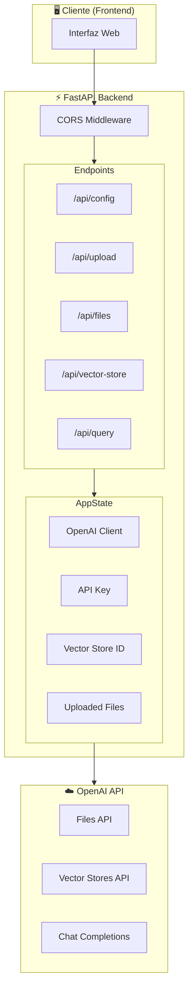
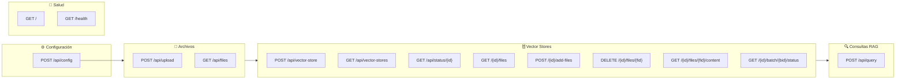
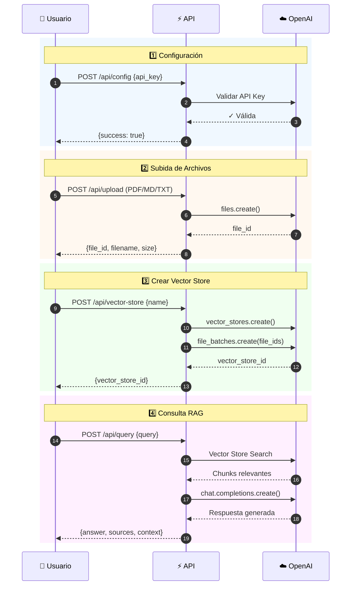
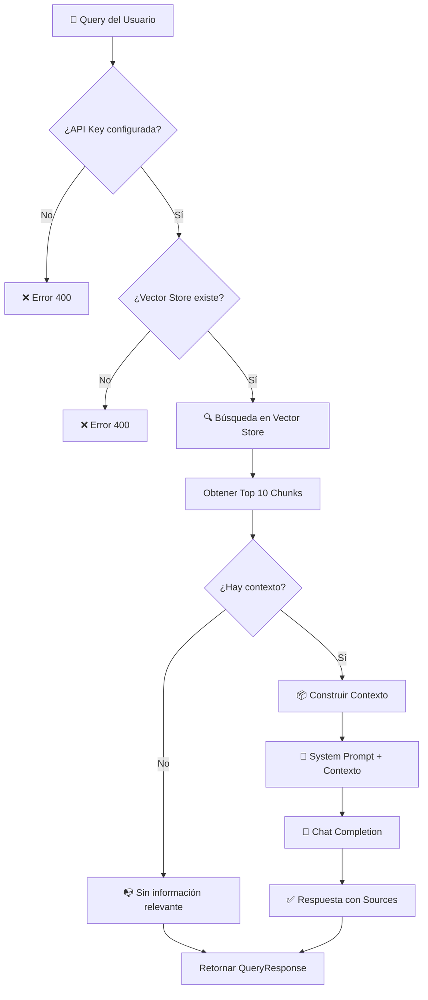
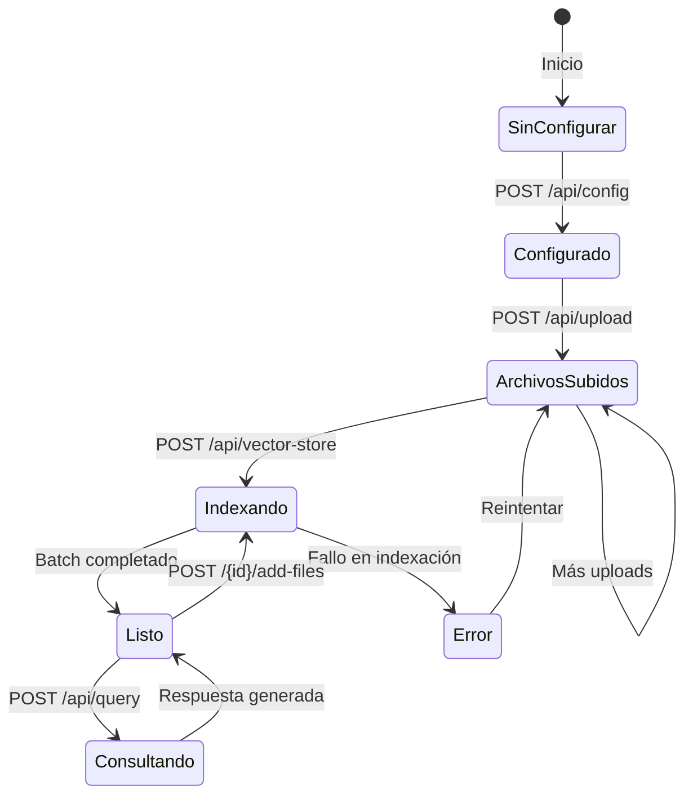
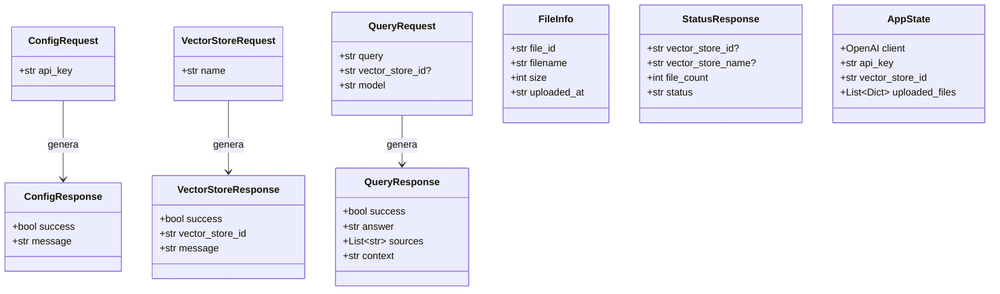
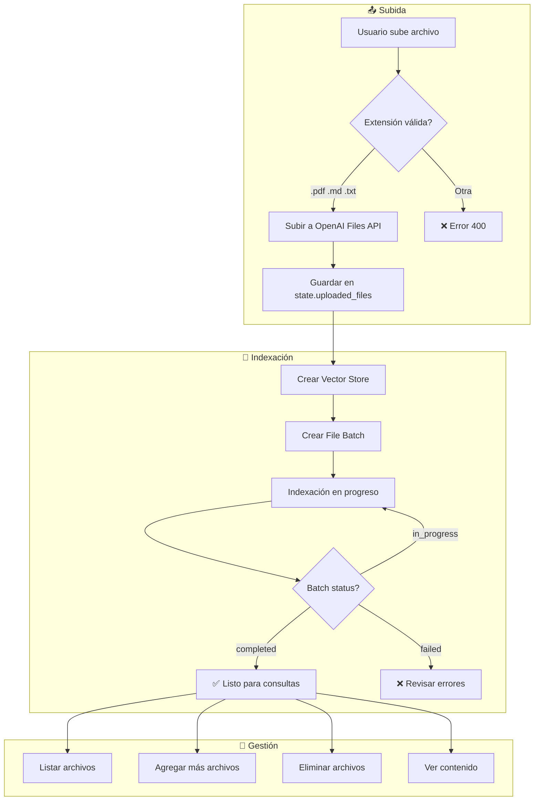
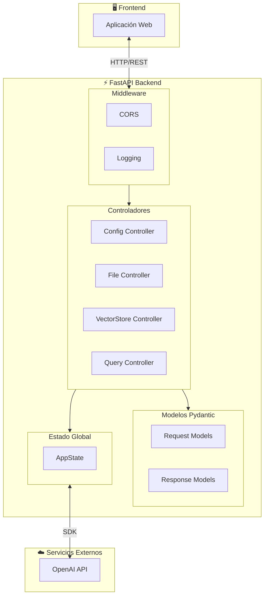

# KnowledgeBase_Manager

Plataforma completa para gestionar Vector Stores con OpenAI. Incluye interfaz web moderna (TypeScript + React) y API REST (Python + FastAPI) para subir documentos, crear bases de conocimiento y hacer consultas con RAG.

## 🚀 Inicio Rápido

### Opción 1: Plataforma Web Completa (Recomendado)

```bash

# 1. Instala el módulo venv 
apt install python3-venv

# 2. Crea el entorno virtual
python3 -m venv venv

# 3. Activa el entorno virtual
source venv/bin/activate

# 4. Instalar dependencias Python
pip install -r requirements.txt

# 5. En otra terminal, instalar dependencias del frontend
cd frontend
npm install
cd ..

# 6. Iniciar toda la plataforma (backend + frontend)
./start_platform.sh
```

Abre http://localhost:3000 en tu navegador.

### Opción 2: Solo Backend API

```bash
# Iniciar solo el backend
./start_backend.sh
```

API disponible en http://localhost:8000

### Opción 3: CLI (Línea de Comandos)

```bash
# 1. Configurar API key
export OPENAI_API_KEY="sk-proj-..."

# 2. Setup completo
python main.py --action setup --pattern "docs/*.md"

# 3. Modo interactivo
python main.py --action interactive
```

## 📁 Estructura del Proyecto

```
KnowledgeBase_Manager/
├── Backend (Python + FastAPI)
│   ├── api.py                      # API REST principal
│   ├── config.py                   # Configuración OpenAI
│   ├── vector_store_manager.py     # Gestión de Vector Stores
│   ├── file_uploader.py            # Subida de archivos
│   ├── batch_manager.py            # Gestión de batches
│   ├── vector_search.py            # Búsqueda vectorial
│   ├── rag_assistant.py            # Asistente RAG
│   ├── main.py                     # CLI
│   └── requirements.txt            # Dependencias Python
│
├── Frontend (TypeScript + React + Vite)
│   ├── src/
│   │   ├── components/
│   │   │   ├── ConfigPanel.tsx
│   │   │   ├── FileUploader.tsx
│   │   │   ├── VectorStoreManager.tsx
│   │   │   └── ChatInterface.tsx
│   │   ├── App.tsx
│   │   └── main.tsx
│   ├── package.json
│   └── vite.config.ts
│
├── Scripts de Inicio
│   ├── start_platform.sh           # Inicia backend + frontend
│   ├── start_backend.sh            # Solo backend
│   └── start_frontend.sh           # Solo frontend
│
└── Documentación
    ├── README.md                   # Este archivo
    └── PLATFORM_README.md          # Documentación detallada
```

## ⚙️ Diagramass de Flujo de Trabajo

### 1. Arquitectura General de la API


### 2. Mapa de Endpoints


### 3. Flujo de Trabajo Principal


### 4. Flujo de Consulta RAG Detallado


### 5. Estados del Vector Store



### 6. Modelos de Datos


### 7. Gestión de Archivos en Vector Store


### 8. Arquitectura de Componentes


## 🎯 Características

### Plataforma Web
- ✅ Interfaz moderna y responsive
- ✅ Configuración de OpenAI API Key
- ✅ Carga de archivos drag & drop (PDF, MD, TXT)
- ✅ Creación automática de Vector Stores
- ✅ Chat interactivo con RAG
- ✅ Visualización de fuentes consultadas

### API REST
- ✅ Endpoints completos para gestión
- ✅ Subida de archivos multipart
- ✅ Creación de Vector Stores
- ✅ Búsqueda vectorial
- ✅ Consultas RAG con GPT-5+
- ✅ CORS configurado

### CLI
- ✅ Setup automatizado
- ✅ Modo interactivo
- ✅ Tests de validación
- ✅ Búsqueda y consultas

## ⚙️ Documentación Completa

Ver [PLATFORM_README.md](PLATFORM_README.md) para:
- Guía de instalación detallada
- Documentación de API endpoints
- Ejemplos de uso
- Solución de problemas
- Arquitectura del sistema

## 🛠️ Requisitos

- Python 3.8+
- Node.js 16+
- OpenAI API Key (con acceso a GPT-5 o superior)

## 📖 Uso de la Plataforma Web

1. **Configurar API Key**: Ingresa tu OpenAI API key
2. **Subir Archivos**: Arrastra o selecciona archivos PDF/MD/TXT
3. **Crear Vector Store**: Dale un nombre a tu base de conocimiento
4. **Hacer Consultas**: Pregunta sobre el contenido de tus documentos

## 💡 Ejemplos de Consultas

- "¿Cuál es la política de devoluciones?"
- "¿Cuánto cuesta el envío?"
- "¿Qué productos tienen garantía extendida?"
- "Resume las características principales"

## 🔧 Desarrollo

### Backend
```bash
# Instalar dependencias
pip install -r requirements.txt

# Iniciar con hot-reload
uvicorn api:app --reload --port 8000
```

### Frontend
```bash
cd frontend

# Instalar dependencias
npm install

# Iniciar con hot-reload
npm run dev
```

## 📝 Licencia

Código abierto - Uso libre

---

**Desarrollado con OpenAI API + FastAPI + React + TypeScript**
